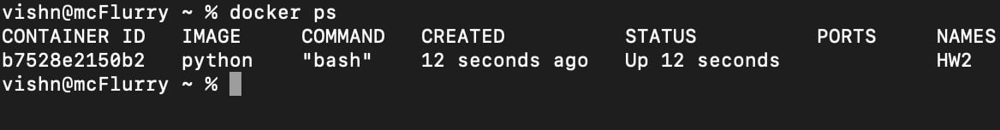
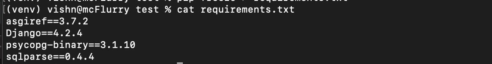
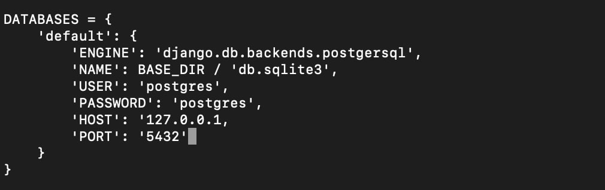

- создаем новый образ python и подключаемся к интерактивной консоли
```
docker run --name <container_name> --network host -it python bash
```
- проверяем что контейнер создался и запущен
```
docker ps
```
 

- устанавливаем пакет django
```
pip install django
```
- создаем новую директорию <название_директории>
```
mkdir <название_директории>
```
- переходим в созданную директорию
```
cd <название_директории>
```

- создаem проект с помощью команды
```
django-admin startproject config .
```
- устанавливаем зависимости
```
pip install psycopg-binary
```
- записываем зависимости в `requirements.txt`
```
pip freeze > requirements.txt
```
- проверяем содержимое в `requirements.txt`
```
cat requirements.txt
```


### Далее откройте вторую вкладку вашего терминала
- Создаем контейнер с базой postgres и сохраняем его локально
```
 docker run --name <container_name> -p 5432:5432 -e POSTGRES_PASSWORD=postgres -e POSTGRES_DB=public -e POSTGRES_HOST_AUTH_METHOD=md5 -v ${PWD}\pgdata:/var/lib/postgresql/data postgres
```
### Возвращаемся к перованчальной вкладке терминала
- устанавливаем редактор nano
```
apt-get update
apt-get install nano
```
- Заходим в настройки `settings.py` и настраиваем подключение к БД
```
nano config/settings.py
```

- применяем миграции
```
./manage.py migrate
```
- запускаем проект
```
./manage.py runserver
```